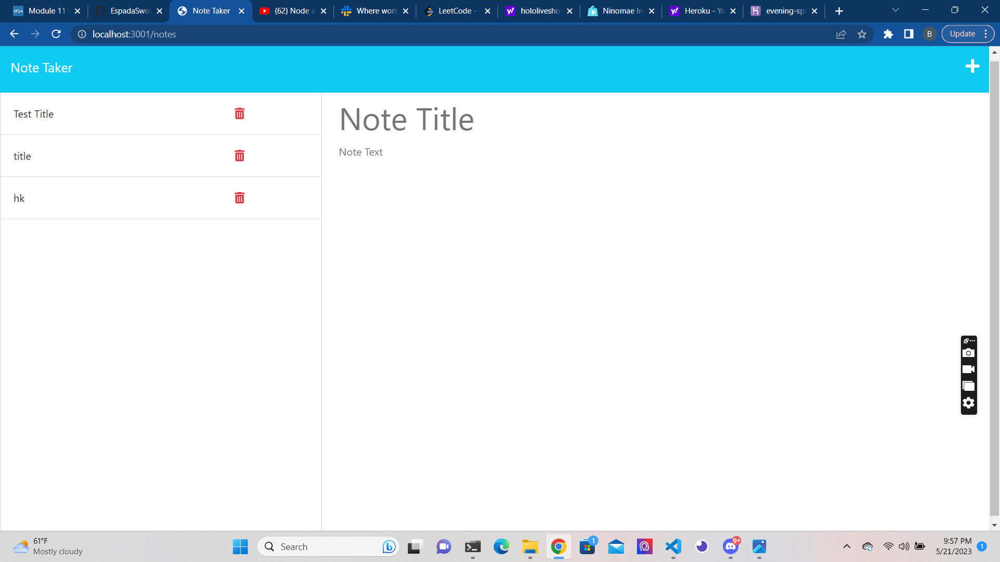

# Note Taker 

## Table of Contents
- [Description](#description)
- [Installation](#installation)
- [Usage](#usage)

## Description
__Primary objectives:__ To create be able to write and save notes

__Process:__ From a preset template, enable the server to take user input of a title and task and save it into a list that will add each new user input as an additonal task entry.

## Installation

Download repository from github links.
https://github.com/EspadaSworn/note-taker
    
Main website
https://evening-spire-28499.herokuapp.com/ 
    
## Usage

To be used to create task list that can be added onto.

## Credits

Meg Meyers